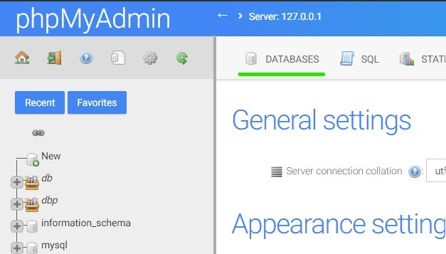

# Belajar PHP PDO dan MySQL (CRUD) - Chapter 1


## Daftar isi:

- [Belajar PHP PDO dan MySQL (CRUD) - Chapter 1](#belajar-php-pdo-dan-mysql-crud---chapter-1)
  - [Daftar isi:](#daftar-isi)
  - [✨ Apa itu PHP dan MySQL ?](#-apa-itu-php-dan-mysql-)
  - [🔨 Tools yang dibutuhkan](#-tools-yang-dibutuhkan)
  - [🔊 Penjelasan & Cara Instalasi tools](#-penjelasan--cara-instalasi-tools)
    - [XAMPP](#xampp)
    - [Visual Studio Code](#visual-studio-code)
    - [Bootstrap 5](#bootstrap-5)
  - [🔑 Mempersiapkan Database untuk CRUD](#-mempersiapkan-database-untuk-crud)
  - [Next Chapter](#next-chapter)

## ✨ Apa itu PHP dan MySQL ?

PHP sendiri sebenarnya merupakan singkatan dari “Hypertext Preprocessor”, yang merupakan sebuah bahasa scripting tingkat tinggi yang dipasang pada dokumen HTML. MySQL adalah sebuah perangkat lunak system manajemen basis data SQL (DBMS) yang multithread, dan multi-user.

PHP dan MySQL, seolah pasangan sejati yang tak terpisahkan. Keduanya paling sering disandingkan dalam pembuatan aplikasi berbasis web (web application development). Tak heran jika begitu banyak fungsi terkait dengan MySQL yang disediakan oleh PHP. Setidaknya terdapat 45 fungsi PHP terkait dengan MySQL mulai dari koneksi, pengambilan data, query data hingga informasi server MySQL.

Operasi CRUD atau biasa di kenal dengan Create, Read Update dan Delete merupakan operasi yang sangat sering digunakan ketika seorang programer membuat suatu program dengan PHP. CRUD merupakan salah satu inti dari sebuah pemrograman karena di dalam suatu program biasanya mencakup operasi Create atau menciptakan data, Read atau Menampilkan data, Update atau mengedit suatu data dan Delete atau menghapus data.

## 🔨 Tools yang dibutuhkan

Tools yang dibutuhkan untuk mempelajari PHP dan MySQL ini adalah sebagai berikut:

| No  | Tools                       | Link                                        |
| --- | --------------------------- | ------------------------------------------- |
| 1   | XAMPP (minimal versi 7.2.0) | https://www.apachefriends.org/download.html |
| 2   | Visual Studio Code          | https://code.visualstudio.com/download      |
| 3   | Bootstrap 5                 | https://getbootstrap.com/                   |

> **Catatan:** Untuk memudahkan dalam mempelajari PHP dan MySQL, saya sarankan untuk menggunakan XAMPP versi 7.2.0 atau lebih tinggi. Karena pada versi 7.2.0 sudah terdapat fitur PHP 7.2.0 yang sudah mendukung fitur PHP 7.2.0.

## 🔊 Penjelasan & Cara Instalasi tools

### XAMPP

Xampp dalam development PHP dan MySQL, digunakan untuk sebagai local server dan local database untuk development project menggunakan PHP dan MySQL. Lalu kenapa harus menggunakan minimal PHP 7 ke atas, dikarenakan PHP versi dibawahnya sudah usang dan pasti banyak bug yang bisa merusak atau menjadi celah didalam system kita nanti xampp adalah tools paling pertama yang wajib di install.

### Visual Studio Code

Visual Studio Code adalah editor kode sumber yang dikembangkan oleh Microsoft untuk Windows, Linux dan macOS. Banyak developer yang menggunakan Visual Studio Code atau VScode untuk keseharian mereka dalam membangun sebuah project besar dari PHP, Python, Go dan lain- lain.

### Bootstrap 5

Bootstrap adalah sebuah framework CSS yang digunakan untuk membangun tampilan website yang responsif dan mobile friendly. Bootstrap 5 merupakan versi terbaru dari Bootstrap yang dirilis pada tanggal 16 September 2020.

## 🔑 Mempersiapkan Database untuk CRUD

Sebelum kita memulai membuat crud, database adalah hal yang paling penting karena database adalah tempat kita menyimpan data dari hasil crud nanti. Jika menggunakan xampp, maka jalankan xampp dan start apache dan mysql kita seperti dibawah ini :


> **Catatan:**
> Perhatikan Apache dan MySQL harus sudah berwarna hijau menandakan sudah berjalan 100%. Jika tidak silahkan cek kembali error yang muncul.

Setelah itu buka browser dan ketikkan url dibawah ini :

```bash
http://localhost/phpmyadmin
```


Klik menu database :



Selanjutnya masukan nama database yang kita ingin buat, yaitu **db_student** dan klik tombol create.


Setelah itu kita akan masuk ke dalam database yang kita buat tadi, yaitu **db_student**. Klik menu SQL dan masukan query dibawah ini untuk membuat tabel **student**.

```sql
CREATE TABLE `students` (
  `id` int(11) NOT NULL AUTO_INCREMENT PRIMARY KEY,
  `name` varchar(255) NOT NULL,
  `nis` varchar(255) NOT NULL,
  `class` varchar(255) NOT NULL,
  `major` varchar(255) NOT NULL,
  `address` varchar(255)
) ENGINE=InnoDB DEFAULT CHARSET=utf8mb4;
```

Setelah itu klik tombol go untuk menjalankan query yang kita buat tadi.

## Next Chapter

Sekarang kita sudah menginstall tools yang dibutuhkan dan juga sudah membuat database untuk CRUD. Selanjutnya kita akan membuat view untuk CRUD menggunakan Bootstrap 5. [Klik disini untuk melanjutkan ke chapter selanjutnya](../chapter-2/README.md).

[](#belajar-php-pdo-dan-mysql-crud---chapter-1)
