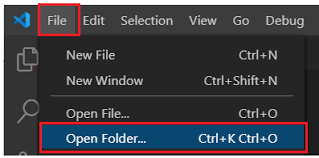
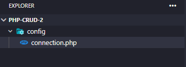
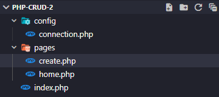
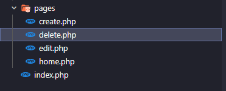

# Belajar PHP PDO dan MySQL (CRUD) - Chapter 2


<!-- chpater list -->

## Daftar isi:

- [Belajar PHP PDO dan MySQL (CRUD) - Chapter 2](#belajar-php-pdo-dan-mysql-crud---chapter-2)
  - [Daftar isi:](#daftar-isi)
  - [🎮 Development PHP pada Local Computer (Connection & Views)](#-development-php-pada-local-computer-connection--views)
    - [Membuat Project PHP](#membuat-project-php)
    - [Membuat File PHP](#membuat-file-php)
      - [1. Membuat File `config/connection.php`](#1-membuat-file-configconnectionphp)
      - [2. Membuat File `index.php`](#2-membuat-file-indexphp)
      - [3. Membuat File `components/navbar.php`](#3-membuat-file-componentsnavbarphp)
      - [4. Membuat File `pages/home.php`](#4-membuat-file-pageshomephp)
      - [5. Membuat File `pages/create.php`](#5-membuat-file-pagescreatephp)
      - [6. Membuat File `pages/edit.php`](#6-membuat-file-pageseditphp)
      - [7. Membuat File `pages/delete.php`](#7-membuat-file-pagesdeletephp)
  - [Next Chapter](#next-chapter)

## 🎮 Development PHP pada Local Computer (Connection & Views)

Setelah kita mempersiapkan database untuk CRUD, selanjutnya kita akan membuat project PHP pada local computer kita.

### Membuat Project PHP

Hal pertama yang harus kita lakukan adalah membuat project PHP pada local computer kita. Untuk membuat project PHP, kita akan menggunakan Visual Studio Code sebagai editor nya. Pertama-tama buka Visual Studio Code dan buat folder baru dengan nama **belajar-php-crud**.

```bash
1. Buka Visual Studio Code
```

```bash
2. Klik menu File > Open Folder > Pilih folder Xampp/htdocs/
```

```bash
3. Buat folder dan Masukan nama folder belajar-php-crud
```

```bash
4. Open folder belajar-php-crud
```



> **Catatan:** **Xampp/htdocs/** adalah folder default untuk menyimpan project PHP pada local computer kita. Jika kalian menginstall xampp pada folder yang berbeda, maka silahkan sesuaikan dengan folder yang kalian gunakan.

### Membuat File PHP

Setelah kita membuat project PHP, selanjutnya kita akan membuat file PHP. File PHP yang akan kita buat adalah sebagai berikut :

| No  | File PHP              | Deskripsi                                                                 |
| --- | --------------------- | ------------------------------------------------------------------------- |
| 1   | config/connection.php | File ini digunakan untuk menghubungkan PHP dengan database MySQL kita.    |
| 2   | index.php             | File ini berfungsi sebagai file utama yang akan kita akses pada web kita. |
| 3   | components/navbar.php | File ini digunakan untuk membuat navbar pada halaman web kita.            |
| 4   | pages/home.php        | File ini digunakan untuk membuat halaman home pada web kita.              |
| 5   | pages/create.php      | File ini digunakan untuk membuat halaman create pada web kita.            |
| 6   | pages/update.php      | File ini digunakan untuk membuat halaman update pada web kita.            |
| 7   | pages/delete.php      | File ini digunakan untuk membuat halaman delete pada web kita.            |

Untuk membuat file PHP, kita akan menggunakan Visual Studio Code sebagai editor nya. Pertama-tama buka Visual Studio Code dan buka folder **belajar-php-crud** yang sudah kita buat tadi.

#### 1. Membuat File `config/connection.php`

File `config/connection.php` digunakan untuk menghubungkan PHP dengan database MySQL kita. Untuk membuat file `config/connection.php`, kita akan menggunakan Visual Studio Code sebagai editor nya. Pertama-tama buka Visual Studio Code dan buka folder **belajar-php-crud** yang sudah kita buat tadi.

```bash
1. Klik menu File > New File
```

```bash
2. Masukan nama file config/connection.php
```

```bash
3. Save file connection.php
```

[](./images/create-config-php.png)

Setelah itu kita akan membuat koneksi ke database MySQL kita. Kita akan menggunakan new PDO() untuk membuat koneksi ke database MySQL kita. Kita akan membuat koneksi ke database MySQL kita dengan menggunakan parameter dibawah ini :

| Parameter  | Deskripsi                          |
| ---------- | ---------------------------------- |
| localhost  | Hostname dari database MySQL kita. |
| root       | Username dari database MySQL kita. |
| password   | Password dari database MySQL kita. |
| db_student | Nama database MySQL kita.          |

Untuk membuat koneksi ke database MySQL kita, kita akan menggunakan kode dibawah ini :

```php
<?php
    $host = "localhost";
    $user = "root";
    $password = "";
    $database = "db_student";

    // Create connection
    $conn = new PDO("mysql:host=$host;dbname=$database", $user, $password);

    // Check connection
    if (!$conn) {
      die("Connection failed: " . mysqli_connect_error());
    }
?>
```

Setelah itu kita akan menyimpan file `config/connection.php` yang sudah kita buat tadi.

#### 2. Membuat File `index.php`

File `index.php` berfungsi sebagai file utama yang akan kita akses pada web kita. Untuk membuat file `index.php`, kita akan menggunakan Visual Studio Code sebagai editor nya. Pertama-tama buka Visual Studio Code dan buka folder **belajar-php-crud** yang sudah kita buat tadi.

```bash
1. Klik menu File > New File
```

```bash
2. Masukan nama file index.php
```

```bash
3. Save file index.php
```

[](./images/create-index-php.png)

Setelah itu kita akan membuat dokument HTML pada file `index.php` yang sudah kita buat tadi. Kita akan menggunakan bootstrap untuk membuat tampilan web kita. tag `include_once()` untuk memanggil file `components/navbar.php`. Kita akan membuat file `components/navbar.php` pada langkah selanjutnya

```php
<!DOCTYPE html>
<html lang="en">

<head>
  <meta charset="UTF-8">
  <meta http-equiv="X-UA-Compatible" content="IE=edge">
  <meta name="viewport" content="width=device-width, initial-scale=1.0">
  <title>Data Student</title>

  // include bootsrap css
  <link href="https://cdn.jsdelivr.net/npm/bootstrap@5.2.2/dist/css/bootstrap.min.css" rel="stylesheet" integrity="sha384-Zenh87qX5JnK2Jl0vWa8Ck2rdkQ2Bzep5IDxbcnCeuOxjzrPF/et3URy9Bv1WTRi" crossorigin="anonymous">
</head>

<body>

  <!-- navbar -->
  <?php include_once 'components/navbar.php' ?>
  <!-- end navbar -->

  <!-- content -->
  <div class="container mt-4">
    <div class="row">
      <div class="col-md-12">
        <?php
        if (empty($_GET["page"])) {
          include "pages/home.php";
        } elseif ($_GET['page'] == 'create') {
          include "pages/create.php";
        } elseif ($_GET['page'] == 'edit') {
          include "pages/edit.php";
        } elseif ($_GET['page'] == 'delete') {
          include "pages/delete.php";
        } else {
          include "pages/notfound.php";
        }
        ?>
      </div>
    </div>
  </div>
  <!-- end content -->

  // include bootsrap js
  <script src="https://cdn.jsdelivr.net/npm/bootstrap@5.2.2/dist/js/bootstrap.bundle.min.js" integrity="sha384-OERcA2EqjJCMA+/3y+gxIOqMEjwtxJY7qPCqsdltbNJuaOe923+mo//f6V8Qbsw3" crossorigin="anonymous"></script>

</body>

</html>

```

> $\_GET['page'] digunakan untuk menentukan halaman mana yang akan kita akses

| $\_GET['page'] | Halaman yang akan kita akses |
| -------------- | ---------------------------- |
| null           | pages/home.php               |
| create         | pages/create.php             |
| edit           | pages/edit.php               |
| delete         | pages/delete.php             |

Setelah itu kita akan menyimpan file `index.php` yang sudah kita buat tadi.

#### 3. Membuat File `components/navbar.php`

File `components/navbar.php` digunakan untuk membuat navbar pada halaman web kita. Untuk membuat file `components/navbar.php` kita akan menggunakan Visual Studio Code sebagai editor nya. Pertama-tama buka Visual Studio Code dan buka folder **belajar-php-crud** yang sudah kita buat tadi.

```bash
1. Klik menu File > New File
```

```bash
2. Masukan nama file components/navbar.php
```

```bash
3. Save file components/navbar.php
```

[](./images/create-navbar-component.png)

Setelah itu kita akan membuat navbar pada file `components/navbar.php` yang sudah kita buat tadi. Kita akan membuat navbar dengan menggunakan kode dibawah ini :

```html
<nav class="navbar navbar-expand-lg navbar-light bg-light py-3">
  <div class="container">
    <a class="navbar-brand" href="#">SMKN 17</a>
    <button
      class="navbar-toggler"
      type="button"
      data-bs-toggle="collapse"
      data-bs-target="#navbarNav"
      aria-controls="navbarNav"
      aria-expanded="false"
      aria-label="Toggle navigation"
    >
      <span class="navbar-toggler-icon"></span>
    </button>
    <div class="collapse navbar-collapse" id="navbarNav">
      <ul class="navbar-nav">
        <li class="nav-item">
          <a class="nav-link active" aria-current="page" href="#">Home</a>
        </li>
        <li class="nav-item">
          <a class="nav-link" href="#">About</a>
        </li>
      </ul>
    </div>
  </div>
</nav>
```

Setelah itu kita akan menyimpan file `components/navbar.php` yang sudah kita buat tadi.

#### 4. Membuat File `pages/home.php`

File `pages/home.php` digunakan untuk membuat halaman home pada web kita. Untuk membuat file `pages/home.php` kita akan menggunakan Visual Studio Code sebagai editor nya. Pertama-tama buka Visual Studio Code dan buka folder **belajar-php-crud** yang sudah kita buat tadi.

```bash
1. Klik menu File > New File
```

```bash
2. Masukan nama file pages/home.php
```

```bash
3. Save file pages/home.php
```

[](./images/create-homepage.png)

Setelah itu kita akan membuat halaman home pada file `pages/home.php` yang sudah kita buat tadi. Kita akan membuat halaman home dengan menggunakan kode dibawah ini :

```html
<h2>Data Student</h2>

<!-- add button -->
<a href="?page=create" class="btn btn-success mt-2 mb-3">Add Student</a>

<table class="table table-striped">
  <thead>
    <tr>
      <th scope="col">No</th>
      <th scope="col">Name</th>
      <th scope="col">Nis</th>
      <th scope="col">Class</th>
      <th scope="col">Major</th>
      <th scope="col">Address</th>
      <th scope="col">Action</th>
    </tr>
  </thead>
  <tbody>
    <tr>
      <th scope="row">1</th>
      <td>John Doe</td>
      <td>1234567890</td>
      <td>2019</td>
      <td>Computer Science</td>
      <td>Jakarta</td>
      <td>
        <a href="?page=edit" class="btn btn-warning">Edit</a>
        <a href="?page=delete" class="btn btn-danger">Delete</a>
      </td>
    </tr>
    <tr>
      <th scope="row">2</th>
      <td>John Doe</td>
      <td>1234567890</td>
      <td>2019</td>
      <td>Computer Science</td>
      <td>Jakarta</td>
      <td>
        <a href="?page=edit" class="btn btn-warning">Edit</a>
        <a href="?page=delete" class="btn btn-danger">Delete</a>
      </td>
    </tr>
    <tr>
      <th scope="row">3</th>
      <td>John Doe</td>
      <td>1234567890</td>
      <td>2019</td>
      <td>Computer Science</td>
      <td>Jakarta</td>
      <td>
        <a href="?page=edit" class="btn btn-warning">Edit</a>
        <a href="?page=delete" class="btn btn-danger">Delete</a>
      </td>
    </tr>
  </tbody>
</table>
```

Setelah itu kita akan menyimpan file `pages/home.php` yang sudah kita buat tadi.

#### 5. Membuat File `pages/create.php`

File `pages/create.php` digunakan untuk membuat halaman create pada web kita. Untuk membuat file `pages/create.php` kita akan menggunakan Visual Studio Code sebagai editor nya. Pertama-tama buka Visual Studio Code dan buka folder **belajar-php-crud** yang sudah kita buat tadi.

```bash
1. Klik menu File > New File
```

```bash
2. Masukan nama file pages/create.php
```

```bash
3. Save file pages/create.php
```

[](./images/create-pages.png)

Setelah itu kita akan membuat halaman create pada file `pages/create.php` yang sudah kita buat tadi. Kita akan membuat halaman create dengan menggunakan kode dibawah ini :

```html
<!-- add form -->
<h2>Add Student</h2>

<form action="" method="POST">
  <div class="mb-3">
    <label for="name" class="form-label">Name</label>
    <input
      type="text"
      class="form-control"
      id="name"
      name="name"
      placeholder="Enter name"
      autocomplete="off"
      required
      autofocus
    />
  </div>
  <div class="mb-3">
    <label for="nis" class="form-label">Nis</label>
    <input
      type="number"
      class="form-control"
      id="nis"
      name="nis"
      placeholder="Enter nis"
      autocomplete="off"
      required
    />
  </div>
  <div class="mb-3">
    <label for="class" class="form-label">Class</label>
    <select name="class" id="class" class="form-select" required>
      <option value="" disabled selected>Select class</option>
      <option value="10">10</option>
      <option value="11">11</option>
      <option value="12">12</option>
    </select>
  </div>
  <div class="mb-3">
    <label for="major" class="form-label">Major</label>
    <select name="major" id="major" class="form-select" required>
      <option value="" disabled selected>Select major</option>
      <option value="RPL">RPL</option>
      <option value="AKL">AKL</option>
      <option value="OTKP">OTKP</option>
      <option value="BDP">BDP</option>
    </select>
  </div>
  <div class="mb-3">
    <label for="address" class="form-label">Address</label>
    <textarea
      name="address"
      id="address"
      class="form-control"
      placeholder="Enter address"
      autocomplete="off"
      required
      rows="5"
    ></textarea>
  </div>
  <!-- back button -->
  <a href="index.php" class="btn btn-secondary">Back</a>
  <button
    type="submit"
    name="submit"
    class="btn btn-success"
    onclick="return confirm('Are you sure want to add this data?')"
  >
    Add
  </button>
</form>
```

Setelah itu kita akan menyimpan file `pages/create.php` yang sudah kita buat tadi.

#### 6. Membuat File `pages/edit.php`

File `pages/edit.php` digunakan untuk membuat halaman edit pada web kita. Untuk membuat file `pages/edit.php` kita akan menggunakan Visual Studio Code sebagai editor nya. Pertama-tama buka Visual Studio Code dan buka folder **belajar-php-crud** yang sudah kita buat tadi.

```bash
1. Klik menu File > New File
```

```bash
2. Masukan nama file pages/edit.php
```

```bash
3. Save file pages/edit.php
```

[](./images/edit-pages.png)

Setelah itu kita akan membuat halaman edit pada file `pages/edit.php` yang sudah kita buat tadi. Kita akan membuat halaman edit dengan menggunakan kode dibawah ini :

```html
<!-- edit form -->
<h2>Edit Student</h2>

<form action="" method="POST">
  <div class="mb-3">
    <label for="name" class="form-label">Name</label>
    <input
      type="text"
      class="form-control"
      id="name"
      name="name"
      placeholder="Enter name"
      autocomplete="off"
      required
      autofocus
      value=""
    />
  </div>
  <div class="mb-3">
    <label for="nis" class="form-label">Nis</label>
    <input
      type="number"
      class="form-control"
      id="nis"
      name="nis"
      placeholder="Enter nis"
      autocomplete="off"
      required
      value=""
    />
  </div>
  <div class="mb-3">
    <label for="class" class="form-label">Class</label>
    <select name="class" id="class" class="form-select" required>
      <option value="" disabled selected>Select class</option>
      <option value="10">10</option>
      <option value="11">11</option>
      <option value="12">12</option>
    </select>
  </div>
  <div class="mb-3">
    <label for="major" class="form-label">Major</label>
    <select name="major" id="major" class="form-select" required>
      <option value="" disabled selected>Select major</option>
      <option value="RPL">RPL</option>
      <option value="AKL">AKL</option>
      <option value="OTKP">OTKP</option>
      <option value="BDP">BDP</option>
    </select>
  </div>
  <div class="mb-3">
    <label for="address" class="form-label">Address</label>
    <textarea
      name="address"
      id="address"
      class="form-control"
      placeholder="Enter address"
      autocomplete="off"
      required
      rows="5"
    ></textarea>
  </div>
  <!-- back button -->
  <a href="index.php" class="btn btn-secondary">Back</a>
  <button
    type="submit"
    name="submit"
    class="btn btn-primary"
    onclick="return confirm('Are you sure want to edit this data?')"
  >
    Edit
  </button>
</form>
```

Setelah itu kita akan menyimpan file `pages/edit.php` yang sudah kita buat tadi.

#### 7. Membuat File `pages/delete.php`

File `pages/delete.php` digunakan untuk membuat halaman delete pada web kita. Untuk membuat file `pages/delete.php` kita akan menggunakan Visual Studio Code sebagai editor nya. Pertama-tama buka Visual Studio Code dan buka folder **belajar-php-crud** yang sudah kita buat tadi.

```bash
1. Klik menu File > New File
```

```bash
2. Masukan nama file pages/delete.php
```

```bash
3. Save file pages/delete.php
```

[](./images/delete-pages.png)

> **Catatan :** File `pages/delete.php` berisi kode php yang akan kita gunakan untuk menghapus data pada database. Kita tidak perlu membuat halaman delete pada file `pages/delete.php` karena kita akan menghapus data dengan link yang ada pada halaman `index.php`.

## Next Chapter

Sekarang kita sudah membuat halaman-halaman yang ada pada web kita. Selanjutnya Kita akan memodifikasi file `pages/home.php`, `pages/create.php`, `pages/edit.php`, dan `pages/delete.php` untuk menghubungkan file tersebut dengan database dan membuat fungsi CRUD pada web kita. [Klik disini untuk melanjutkan ke chapter selanjutnya](../chapter-3/README.md).

[](#crud-php-mysql-bootstrap-5)
