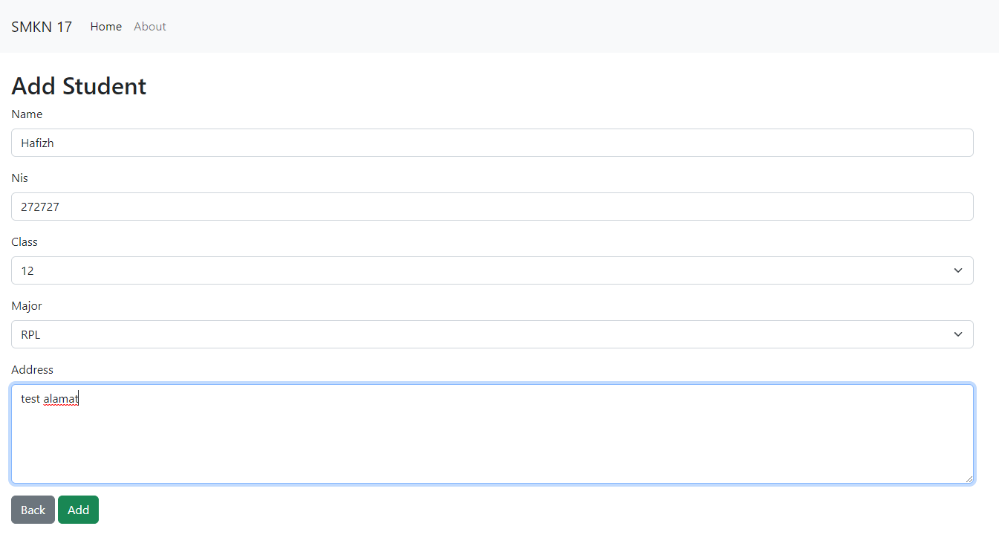
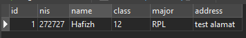
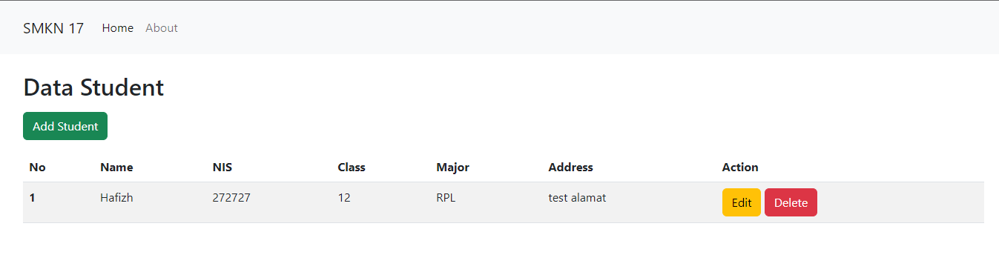
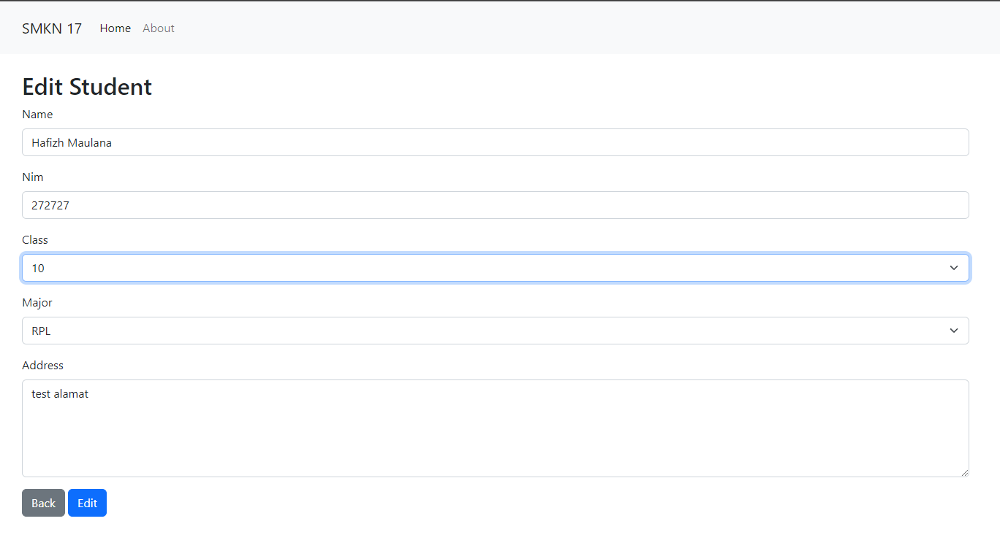
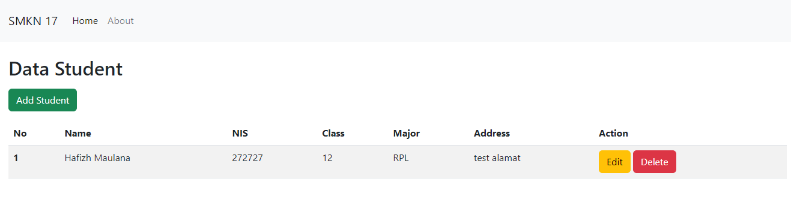
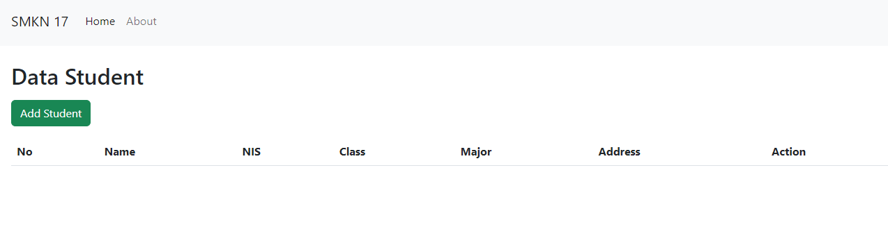

# Belajar PHP PDO dan MySQL (CRUD) - Chapter 3


<!-- chpater list -->

## Daftar isi:

- [Belajar PHP PDO dan MySQL (CRUD) - Chapter 3](#belajar-php-pdo-dan-mysql-crud---chapter-3)
  - [Daftar isi:](#daftar-isi)
  - [📌 Development PHP pada Local Computer (CRUD)](#-development-php-pada-local-computer-crud)
    - [1. Create](#1-create)
    - [2. Read](#2-read)
    - [3. Update](#3-update)
    - [4. Delete Data](#4-delete-data)
  - [Selesai](#selesai)

## 📌 Development PHP pada Local Computer (CRUD)

Setelah kita berhasil membuat connection dan membuat view, sekarang kita akan membuat fungsi CRUD (Create, Read, Update, Delete) pada PHP.

### 1. Create

Pada bagian ini kita akan membuat fungsi untuk menambahkan data baru ke dalam database. Untuk membuat fungsi ini kita akan membuat sebuah form untuk menambahkan data baru.

`pages/create.php`

```php
<?php

  // get data from form
  if (isset($_POST['submit'])) {
    $name = $_POST['name'];
    $nis = $_POST['nis'];
    $class = $_POST['class'];
    $major = $_POST['major'];
    $address = $_POST['address'];

    $data = [
      'name' => $name,
      'nis' => $nis,
      'class' => $class,
      'major' => $major,
      'address' => $address
    ];

    // insert data to database
    $query = $conn->prepare("INSERT INTO students (name, nis, class, major, address) VALUES (:name, :nis, :class, :major, :address)");

    $query->bindParam(':name', $data['name']);
    $query->bindParam(':nis', $data['nis']);
    $query->bindParam(':class', $data['class']);
    $query->bindParam(':major', $data['major']);
    $query->bindParam(':address', $data['address']);

    $query->execute();

    // redirect to index.php
    header('Location: index.php');
  }

?>

......
// script ini di tulis di atas <h2>Add Student</h2>
```

Pada script di atas kita akan menangkap data yang dikirimkan dari form menggunakan method `POST` dan menyimpannya ke dalam variabel. Kemudian kita akan membuat sebuah array yang berisi data-data yang akan kita masukkan ke dalam database. Setelah itu kita akan membuat sebuah query untuk memasukkan data ke dalam database. Kemudian kita akan mengeksekusi query tersebut menggunakan `prepare()` dan `execute()`. Setelah itu kita akan mengalihkan halaman ke `index.php` menggunakan `header()`.

setelah itu coba kita jalankan di browser, tambahkan data baru di form yang sudah kita buat.



Cek di database, data sudah masuk ke dalam database.



### 2. Read

Pada bagian ini kita akan membuat fungsi untuk menampilkan data dari database. Untuk membuat fungsi ini kita akan membuat sebuah tabel untuk menampilkan data dari database.

`pages/home.php`

```php
<?php

  // get data from database
  $query = $conn->prepare("SELECT * FROM students");
  $query->execute();

  // fetch data
  $students = $query->fetchAll();

?>

......
// script ini di tulis di atas <h2>Data Student</h2>
```

Pada script di atas kita akan membuat sebuah query untuk mengambil data dari database. Kemudian kita akan mengeksekusi query tersebut menggunakan `prepare()` dan `fetchAll()`. Setelah itu kita akan menampung hasil query tersebut ke dalam variabel `$students`. Kemudian kita akan menampilkan data tersebut ke dalam tabel.

setelah itu ganti table yang ada di `pages/home.php` dengan script di bawah ini:

```php
....
<table class="table table-striped">
  <thead>
    <tr>
      <th scope="col">No</th>
      <th scope="col">Name</th>
      <th scope="col">NIS</th>
      <th scope="col">Class</th>
      <th scope="col">Major</th>
      <th scope="col">Address</th>
      <th scope="col">Action</th>
    </tr>
  </thead>
  <tbody>
    <?php $i = 1; ?>
    <?php foreach ($students as $student) : ?>
      <tr>
        <th scope="row"><?= $i; ?></th>
        <td><?= $student['name']; ?></td>
        <td><?= $student['nis']; ?></td>
        <td><?= $student['class']; ?></td>
        <td><?= $student['major']; ?></td>
        <td><?= $student['address']; ?></td>
        <td>
          <a href="index.php?page=edit&id=<?= $student['id']; ?>" class="btn btn-warning">Edit</a>
          <a href="index.php?page=delete&id=<?= $student['id']; ?>" class="btn btn-danger">Delete</a>
        </td>
      </tr>
      <?php $i++; ?>
    <?php endforeach; ?>
  </tbody>
</table>
....
```

Pada script di atas kita akan membuat sebuah tabel dengan menggunakan bootstrap. Kemudian kita akan membuat sebuah looping untuk menampilkan data dari database ke dalam tabel. Setelah itu kita akan membuat sebuah link untuk mengedit dan menghapus data. Link tersebut akan mengarah ke halaman `edit.php` dan `delete.php` yang akan kita buat di bagian selanjutnya.

setelah itu coba kita jalankan di browser, jika berhasil maka akan muncul seperti ini:



### 3. Update

Pada bagian ini kita akan membuat fungsi untuk mengedit data dari database. Untuk membuat fungsi ini kita akan membuat sebuah form untuk mengedit data. Form ini akan mengarah ke halaman `edit.php`.

`pages/edit.php`

```php
<?php

// get id student from url parameter
$id = $_GET['id'];

// update pdo
if (isset($_POST['submit'])) {
  $name = $_POST['name'];
  $nis = $_POST['nis'];
  $class = $_POST['class'];
  $major = $_POST['major'];
  $address = $_POST['address'];

  $data = [
    'name' => $name,
    'nis' => $nis,
    'class' => $class,
    'major' => $major,
    'address' => $address
  ];

  // update data
  $query = $conn->prepare("UPDATE students SET name = :name, nis = :nis, class = :class, major = :major, address = :address WHERE id = :id");
  $query->bindParam(':name', $data['name']);
  $query->bindParam(':nis', $data['nis']);
  $query->bindParam(':class', $data['class']);
  $query->bindParam(':major', $data['major']);
  $query->bindParam(':address', $data['address']);
  $query->bindParam(':id', $id);
  $query->execute();

  // redirect to home
  header('Location: index.php');
}

?>

......
// script ini di tulis di atas <h2>Edit Student</h2>
```

Pada script di atas kita akan membuat sebuah query untuk mengupdate data dari database. Kemudian kita akan mengeksekusi query tersebut menggunakan `prepare()` dan `execute()`. Setelah itu kita akan mengarahkan ke halaman `index.php` menggunakan `header()`.

setelah itu kita tambahkan script untuk mengambil data dari database berdasarkan id yang kita dapatkan dari url parameter.

```php
<?php

// get data student by id
$query = $conn->prepare("SELECT * FROM students WHERE id = :id");
$query->bindParam(':id', $id);
$query->execute();

// fetch data student
$student = $query->fetch(PDO::FETCH_ASSOC);

?>

......
// script ini di tulis di bawah <h2>Edit Student</h2>
```

Pada script di atas kita akan membuat sebuah query untuk mengambil data dari database berdasarkan id. Kemudian kita akan mengeksekusi query tersebut menggunakan `prepare()` dan `execute()`. Setelah itu kita akan menampung hasil query tersebut ke dalam variabel `$student`.

setelah itu kita tambahkan script untuk menampilkan data dari database ke dalam form.

```php
......
<form action="" method="POST">
  <div class="mb-3">
    <label for="name" class="form-label">Name</label>
    <input type="text" class="form-control" id="name" name="name" placeholder="Enter name" autocomplete="off" required autofocus value="<?= $student['name'] ?>">
  </div>
  <div class="mb-3">
    <label for="nis" class="form-label">Nis</label>
    <input type="number" class="form-control" id="nis" name="nis" placeholder="Enter nis" autocomplete="off" required value="<?= $student['nis'] ?>">
  </div>
  <div class="mb-3">
    <label for="class" class="form-label">Class</label>
    <select name="class" id="class" class="form-select" required>
      <option value="" disabled selected>Select class</option>
      <option value="10" <?= $student['class'] == '10' ? 'selected' : '' ?>>10</option>
      <option value="11" <?= $student['class'] == '11' ? 'selected' : '' ?>>11</option>
      <option value="12" <?= $student['class'] == '12' ? 'selected' : '' ?>>12</option>
    </select>
  </div>
  <div class="mb-3">
    <label for="major" class="form-label">Major</label>
    <select name="major" id="major" class="form-select" required>
      <option value="" disabled selected>Select major</option>
      <option value="RPL" <?= $student['major'] == 'RPL' ? 'selected' : '' ?>>RPL</option>
      <option value="AKL" <?= $student['major'] == 'AKL' ? 'selected' : '' ?>>AKL</option>
      <option value="OTKP" <?= $student['major'] == 'OTKP' ? 'selected' : '' ?>>OTKP</option>
      <option value="BDP" <?= $student['major'] == 'BDP' ? 'selected' : '' ?>>BDP</option>
    </select>
  </div>
  <div class="mb-3">
    <label for="address" class="form-label">Address</label>
    <textarea name="address" id="address" class="form-control" placeholder="Enter address" autocomplete="off" required rows="5"><?= $student['address'] ?></textarea>
  </div>
  <!-- back button -->
  <a href="index.php" class="btn btn-secondary">Back</a>
  <button type="submit" name="submit" class="btn btn-primary" onclick="return confirm('Are you sure want to edit this data?')">Edit</button>
</form>

......
```

Pada script di atas kita akan menampilkan data dari database ke dalam form menggunakan `value="<?= $student['name'] ?>"` dan `<?= $student['class'] == '10' ? 'selected' : '' ?>`.

setelah itu coba untuk update data:



jika berhasil maka akan diarahkan ke halaman `index.php` dan data akan terupdate.



### 4. Delete Data

untuk menghapus data kita akan membuat sebuah file baru dengan nama `delete.php` dan kita tambahkan script berikut:

```php
<?php

// delete pdo
if (isset($_GET['id'])) {
  $id = $_GET['id'];

  $query = $conn->prepare("DELETE FROM students WHERE id = :id");
  $query->bindParam(':id', $id);
  $query->execute();

  header('Location: index.php');
}

?>
```

Pada script di atas kita akan membuat sebuah query untuk menghapus data dari database berdasarkan id. Kemudian kita akan mengeksekusi query tersebut menggunakan `prepare()` dan `execute()`. Setelah itu kita akan mengarahkan ke halaman `index.php` menggunakan `header()`.

Mari kita coba untuk menghapus data jika berhasil maka akan diarahkan ke halaman `index.php` dan data akan terhapus.



## Selesai

Sekian tutorial CRUD sederhana dengan PHP dan MySQL. Semoga bermanfaat. Terima kasih. 🙏
