# Belajar PHP PDO dan MySQL (CRUD)

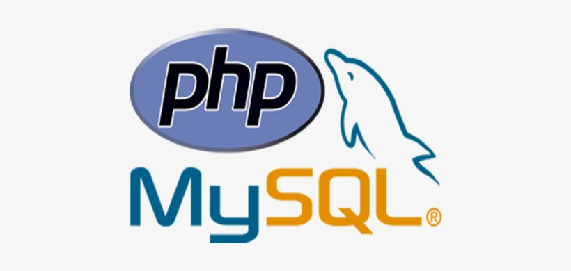

<!-- chpater list -->

## Daftar isi:

- [Belajar PHP PDO dan MySQL (CRUD)](#belajar-php-pdo-dan-mysql-crud)
  - [Daftar isi:](#daftar-isi)
  - [✨ Apa itu PHP dan MySQL ?](#-apa-itu-php-dan-mysql-)
  - [🔨 Tools yang dibutuhkan](#-tools-yang-dibutuhkan)
  - [🔊 Penjelasan & Cara Instalasi tools](#-penjelasan--cara-instalasi-tools)
    - [XAMPP](#xampp)
    - [Visual Studio Code](#visual-studio-code)
    - [Bootstrap 5](#bootstrap-5)
  - [🔑 Mempersiapkan Database untuk CRUD](#-mempersiapkan-database-untuk-crud)
  - [🎮 Development PHP pada Local Computer](#-development-php-pada-local-computer)
    - [Membuat Project PHP](#membuat-project-php)
    - [Membuat File PHP](#membuat-file-php)
      - [1. Membuat File `config/connection.php`](#1-membuat-file-configconnectionphp)
      - [2. Membuat File `index.php`](#2-membuat-file-indexphp)
      - [3. Membuat File `components/navbar.php`](#3-membuat-file-componentsnavbarphp)
      - [4. Membuat File `pages/home.php`](#4-membuat-file-pageshomephp)
      - [5. Membuat File `pages/create.php`](#5-membuat-file-pagescreatephp)
      - [6. Membuat File `pages/edit.php`](#6-membuat-file-pageseditphp)

## ✨ Apa itu PHP dan MySQL ?

PHP sendiri sebenarnya merupakan singkatan dari “Hypertext Preprocessor”, yang merupakan sebuah bahasa scripting tingkat tinggi yang dipasang pada dokumen HTML. MySQL adalah sebuah perangkat lunak system manajemen basis data SQL (DBMS) yang multithread, dan multi-user.

PHP dan MySQL, seolah pasangan sejati yang tak terpisahkan. Keduanya paling sering disandingkan dalam pembuatan aplikasi berbasis web (web application development). Tak heran jika begitu banyak fungsi terkait dengan MySQL yang disediakan oleh PHP. Setidaknya terdapat 45 fungsi PHP terkait dengan MySQL mulai dari koneksi, pengambilan data, query data hingga informasi server MySQL.

Operasi CRUD atau biasa di kenal dengan Create, Read Update dan Delete merupakan operasi yang sangat sering digunakan ketika seorang programer membuat suatu program dengan PHP. CRUD merupakan salah satu inti dari sebuah pemrograman karena di dalam suatu program biasanya mencakup operasi Create atau menciptakan data, Read atau Menampilkan data, Update atau mengedit suatu data dan Delete atau menghapus data.

## 🔨 Tools yang dibutuhkan

Tools yang dibutuhkan untuk mempelajari PHP dan MySQL ini adalah sebagai berikut:

| No  | Tools                       | Link                                        |
| --- | --------------------------- | ------------------------------------------- |
| 1   | XAMPP (minimal versi 7.2.0) | https://www.apachefriends.org/download.html |
| 2   | Visual Studio Code          | https://code.visualstudio.com/download      |
| 3   | Bootstrap 5                 | https://getbootstrap.com/                   |

> **Catatan:** Untuk memudahkan dalam mempelajari PHP dan MySQL, saya sarankan untuk menggunakan XAMPP versi 7.2.0 atau lebih tinggi. Karena pada versi 7.2.0 sudah terdapat fitur PHP 7.2.0 yang sudah mendukung fitur PHP 7.2.0.

## 🔊 Penjelasan & Cara Instalasi tools

### XAMPP

Xampp dalam development PHP dan MySQL, digunakan untuk sebagai local server dan local database untuk development project menggunakan PHP dan MySQL. Lalu kenapa harus menggunakan minimal PHP 7 ke atas, dikarenakan PHP versi dibawahnya sudah usang dan pasti banyak bug yang bisa merusak atau menjadi celah didalam system kita nanti xampp adalah tools paling pertama yang wajib di install.

### Visual Studio Code

Visual Studio Code adalah editor kode sumber yang dikembangkan oleh Microsoft untuk Windows, Linux dan macOS. Banyak developer yang menggunakan Visual Studio Code atau VScode untuk keseharian mereka dalam membangun sebuah project besar dari PHP, Python, Go dan lain- lain.

### Bootstrap 5

Bootstrap adalah sebuah framework CSS yang digunakan untuk membangun tampilan website yang responsif dan mobile friendly. Bootstrap 5 merupakan versi terbaru dari Bootstrap yang dirilis pada tanggal 16 September 2020.

## 🔑 Mempersiapkan Database untuk CRUD

Sebelum kita memulai membuat crud, database adalah hal yang paling penting karena database adalah tempat kita menyimpan data dari hasil crud nanti. Jika menggunakan xampp, maka jalankan xampp dan start apache dan mysql kita seperti dibawah ini :

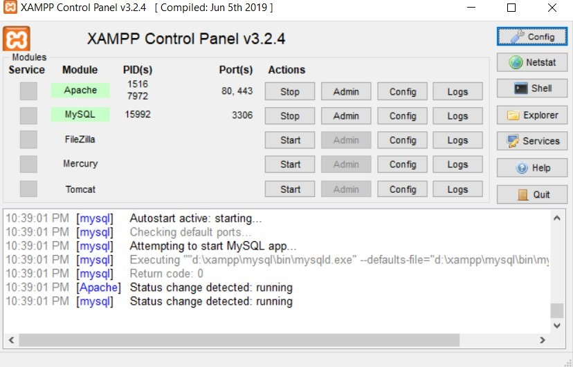

> **Catatan:**
> Perhatikan Apache dan MySQL harus sudah berwarna hijau menandakan sudah berjalan 100%. Jika tidak silahkan cek kembali error yang muncul.

Setelah itu buka browser dan ketikkan url dibawah ini :

```bash
http://localhost/phpmyadmin
```

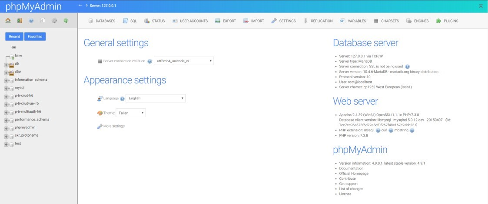

Klik menu database :

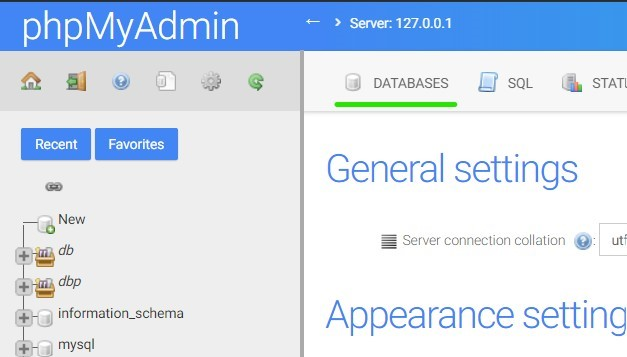

Selanjutnya masukan nama database yang kita ingin buat, yaitu **db_student** dan klik tombol create.

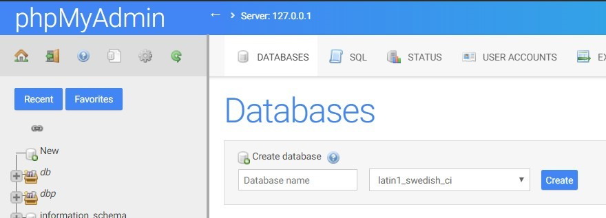

Setelah itu kita akan masuk ke dalam database yang kita buat tadi, yaitu **db_student**. Klik menu SQL dan masukan query dibawah ini :

```sql
CREATE TABLE `students` (
  `id` int(11) NOT NULL,
  `name` varchar(255) NOT NULL,
  `email` varchar(255) NOT NULL,
  `phone` varchar(255) NOT NULL,
  `address` varchar(255) NOT NULL
) ENGINE=InnoDB DEFAULT CHARSET=utf8mb4;
```

Setelah itu klik tombol go untuk menjalankan query yang kita buat tadi.

## 🎮 Development PHP pada Local Computer

Setelah kita mempersiapkan database untuk CRUD, selanjutnya kita akan membuat project PHP pada local computer kita.

### Membuat Project PHP

Hal pertama yang harus kita lakukan adalah membuat project PHP pada local computer kita. Untuk membuat project PHP, kita akan menggunakan Visual Studio Code sebagai editor nya. Pertama-tama buka Visual Studio Code dan buat folder baru dengan nama **belajar-php-crud**.

```bash
1. Buka Visual Studio Code
```

```bash
2. Klik menu File > Open Folder > Pilih folder Xampp/htdocs/
```

```bash
3. Buat folder dan Masukan nama folder belajar-php-crud
```

```bash
4. Open folder belajar-php-crud
```

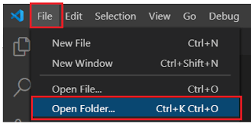

> **Catatan:** **Xampp/htdocs/** adalah folder default untuk menyimpan project PHP pada local computer kita. Jika kalian menginstall xampp pada folder yang berbeda, maka silahkan sesuaikan dengan folder yang kalian gunakan.

### Membuat File PHP

Setelah kita membuat project PHP, selanjutnya kita akan membuat file PHP. File PHP yang akan kita buat adalah sebagai berikut :

| No  | File PHP              | Deskripsi                                                                 |
| --- | --------------------- | ------------------------------------------------------------------------- |
| 1   | config/connection.php | File ini digunakan untuk menghubungkan PHP dengan database MySQL kita.    |
| 2   | index.php             | File ini berfungsi sebagai file utama yang akan kita akses pada web kita. |
| 3   | components/navbar.php | File ini digunakan untuk membuat navbar pada halaman web kita.            |
| 4   | pages/home.php        | File ini digunakan untuk membuat halaman home pada web kita.              |
| 5   | pages/create.php      | File ini digunakan untuk membuat halaman create pada web kita.            |
| 6   | pages/update.php      | File ini digunakan untuk membuat halaman update pada web kita.            |
| 7   | pages/delete.php      | File ini digunakan untuk membuat halaman delete pada web kita.            |

Untuk membuat file PHP, kita akan menggunakan Visual Studio Code sebagai editor nya. Pertama-tama buka Visual Studio Code dan buka folder **belajar-php-crud** yang sudah kita buat tadi.

#### 1. Membuat File `config/connection.php`

File `config/connection.php` digunakan untuk menghubungkan PHP dengan database MySQL kita. Untuk membuat file `config/connection.php`, kita akan menggunakan Visual Studio Code sebagai editor nya. Pertama-tama buka Visual Studio Code dan buka folder **belajar-php-crud** yang sudah kita buat tadi.

```bash
1. Klik menu File > New File
```

```bash
2. Masukan nama file config/connection.php
```

```bash
3. Save file connection.php
```

[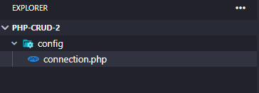](./images/create-config-php.png)

Setelah itu kita akan membuat koneksi ke database MySQL kita. Kita akan menggunakan new PDO() untuk membuat koneksi ke database MySQL kita. Kita akan membuat koneksi ke database MySQL kita dengan menggunakan parameter dibawah ini :

| Parameter  | Deskripsi                          |
| ---------- | ---------------------------------- |
| localhost  | Hostname dari database MySQL kita. |
| root       | Username dari database MySQL kita. |
| password   | Password dari database MySQL kita. |
| db_student | Nama database MySQL kita.          |

Untuk membuat koneksi ke database MySQL kita, kita akan menggunakan kode dibawah ini :

```php
<?php
    $host = "localhost";
    $user = "root";
    $password = "";
    $database = "db_student";

    // Create connection
    $conn = new PDO("mysql:host=$host;dbname=$database", $user, $password);

    // Check connection
    if (!$conn) {
      die("Connection failed: " . mysqli_connect_error());
    }
?>
```

Setelah itu kita akan menyimpan file `config/connection.php` yang sudah kita buat tadi.

#### 2. Membuat File `index.php`

File `index.php` berfungsi sebagai file utama yang akan kita akses pada web kita. Untuk membuat file `index.php`, kita akan menggunakan Visual Studio Code sebagai editor nya. Pertama-tama buka Visual Studio Code dan buka folder **belajar-php-crud** yang sudah kita buat tadi.

```bash
1. Klik menu File > New File
```

```bash
2. Masukan nama file index.php
```

```bash
3. Save file index.php
```

[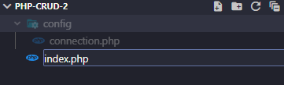](./images/create-index-php.png)

Setelah itu kita akan membuat dokument HTML pada file `index.php` yang sudah kita buat tadi. Kita akan menggunakan bootstrap untuk membuat tampilan web kita. tag `include_once()` untuk memanggil file `components/navbar.php`. Kita akan membuat file `components/navbar.php` pada langkah selanjutnya

```php
<!DOCTYPE html>
<html lang="en">

<head>
  <meta charset="UTF-8">
  <meta http-equiv="X-UA-Compatible" content="IE=edge">
  <meta name="viewport" content="width=device-width, initial-scale=1.0">
  <title>Data Student</title>

  // include bootsrap css
  <link href="https://cdn.jsdelivr.net/npm/bootstrap@5.2.2/dist/css/bootstrap.min.css" rel="stylesheet" integrity="sha384-Zenh87qX5JnK2Jl0vWa8Ck2rdkQ2Bzep5IDxbcnCeuOxjzrPF/et3URy9Bv1WTRi" crossorigin="anonymous">
</head>

<body>

  <!-- navbar -->
  <?php include_once 'components/navbar.php' ?>
  <!-- end navbar -->

  <!-- content -->
  <div class="container mt-4">
    <div class="row">
      <div class="col-md-12">
        <?php
        if (empty($_GET["page"])) {
          include "pages/home.php";
        } elseif ($_GET['page'] == 'create') {
          include "pages/create.php";
        } elseif ($_GET['page'] == 'edit') {
          include "pages/edit.php";
        } elseif ($_GET['page'] == 'delete') {
          include "pages/delete.php";
        } else {
          include "pages/notfound.php";
        }
        ?>
      </div>
    </div>
  </div>
  <!-- end content -->

  // include bootsrap js
  <script src="https://cdn.jsdelivr.net/npm/bootstrap@5.2.2/dist/js/bootstrap.bundle.min.js" integrity="sha384-OERcA2EqjJCMA+/3y+gxIOqMEjwtxJY7qPCqsdltbNJuaOe923+mo//f6V8Qbsw3" crossorigin="anonymous"></script>

</body>

</html>

```

> $\_GET['page'] digunakan untuk menentukan halaman mana yang akan kita akses

| $\_GET['page'] | Halaman yang akan kita akses |
| -------------- | ---------------------------- |
| null           | pages/home.php               |
| create         | pages/create.php             |
| edit           | pages/edit.php               |
| delete         | pages/delete.php             |

Setelah itu kita akan menyimpan file `index.php` yang sudah kita buat tadi.

#### 3. Membuat File `components/navbar.php`

File `components/navbar.php` digunakan untuk membuat navbar pada halaman web kita. Untuk membuat file `components/navbar.php` kita akan menggunakan Visual Studio Code sebagai editor nya. Pertama-tama buka Visual Studio Code dan buka folder **belajar-php-crud** yang sudah kita buat tadi.

```bash
1. Klik menu File > New File
```

```bash
2. Masukan nama file components/navbar.php
```

```bash
3. Save file components/navbar.php
```

[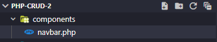](./images/create-navbar-component.png)

Setelah itu kita akan membuat navbar pada file `components/navbar.php` yang sudah kita buat tadi. Kita akan membuat navbar dengan menggunakan kode dibawah ini :

```html
<nav class="navbar navbar-expand-lg navbar-light bg-light py-3">
  <div class="container">
    <a class="navbar-brand" href="#">SMKN 17</a>
    <button
      class="navbar-toggler"
      type="button"
      data-bs-toggle="collapse"
      data-bs-target="#navbarNav"
      aria-controls="navbarNav"
      aria-expanded="false"
      aria-label="Toggle navigation"
    >
      <span class="navbar-toggler-icon"></span>
    </button>
    <div class="collapse navbar-collapse" id="navbarNav">
      <ul class="navbar-nav">
        <li class="nav-item">
          <a class="nav-link active" aria-current="page" href="#">Home</a>
        </li>
        <li class="nav-item">
          <a class="nav-link" href="#">About</a>
        </li>
      </ul>
    </div>
  </div>
</nav>
```

Setelah itu kita akan menyimpan file `components/navbar.php` yang sudah kita buat tadi.

#### 4. Membuat File `pages/home.php`

File `pages/home.php` digunakan untuk membuat halaman home pada web kita. Untuk membuat file `pages/home.php` kita akan menggunakan Visual Studio Code sebagai editor nya. Pertama-tama buka Visual Studio Code dan buka folder **belajar-php-crud** yang sudah kita buat tadi.

```bash
1. Klik menu File > New File
```

```bash
2. Masukan nama file pages/home.php
```

```bash
3. Save file pages/home.php
```

[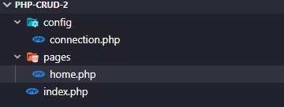](./images/create-homepage.png)

Setelah itu kita akan membuat halaman home pada file `pages/home.php` yang sudah kita buat tadi. Kita akan membuat halaman home dengan menggunakan kode dibawah ini :

```html
<h2>Data Student</h2>

<!-- add button -->
<a href="?page=create" class="btn btn-success mt-2 mb-3">Add Student</a>

<table class="table table-striped">
  <thead>
    <tr>
      <th scope="col">No</th>
      <th scope="col">Name</th>
      <th scope="col">Nim</th>
      <th scope="col">Cass</th>
      <th scope="col">Major</th>
      <th scope="col">Address</th>
      <th scope="col">Action</th>
    </tr>
  </thead>
  <tbody>
    <tr>
      <th scope="row">1</th>
      <td>John Doe</td>
      <td>1234567890</td>
      <td>2019</td>
      <td>Computer Science</td>
      <td>Jakarta</td>
      <td>
        <a href="?page=edit" class="btn btn-warning">Edit</a>
        <a href="?page=delete" class="btn btn-danger">Delete</a>
      </td>
    </tr>
    <tr>
      <th scope="row">2</th>
      <td>John Doe</td>
      <td>1234567890</td>
      <td>2019</td>
      <td>Computer Science</td>
      <td>Jakarta</td>
      <td>
        <a href="?page=edit" class="btn btn-warning">Edit</a>
        <a href="?page=delete" class="btn btn-danger">Delete</a>
      </td>
    </tr>
    <tr>
      <th scope="row">3</th>
      <td>John Doe</td>
      <td>1234567890</td>
      <td>2019</td>
      <td>Computer Science</td>
      <td>Jakarta</td>
      <td>
        <a href="?page=edit" class="btn btn-warning">Edit</a>
        <a href="?page=delete" class="btn btn-danger">Delete</a>
      </td>
    </tr>
  </tbody>
</table>
```

Setelah itu kita akan menyimpan file `pages/home.php` yang sudah kita buat tadi.

#### 5. Membuat File `pages/create.php`

File `pages/create.php` digunakan untuk membuat halaman create pada web kita. Untuk membuat file `pages/create.php` kita akan menggunakan Visual Studio Code sebagai editor nya. Pertama-tama buka Visual Studio Code dan buka folder **belajar-php-crud** yang sudah kita buat tadi.

```bash
1. Klik menu File > New File
```

```bash
2. Masukan nama file pages/create.php
```

```bash
3. Save file pages/create.php
```

[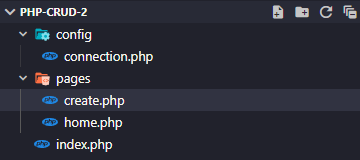](./images/create-pages.png)

Setelah itu kita akan membuat halaman create pada file `pages/create.php` yang sudah kita buat tadi. Kita akan membuat halaman create dengan menggunakan kode dibawah ini :

```html
<!-- add form -->
<h2>Add Student</h2>

<form action="" method="POST">
  <div class="mb-3">
    <label for="name" class="form-label">Name</label>
    <input
      type="text"
      class="form-control"
      id="name"
      name="name"
      placeholder="Enter name"
      autocomplete="off"
      required
      autofocus
    />
  </div>
  <div class="mb-3">
    <label for="nim" class="form-label">Nim</label>
    <input
      type="number"
      class="form-control"
      id="nim"
      name="nim"
      placeholder="Enter nim"
      autocomplete="off"
      required
    />
  </div>
  <div class="mb-3">
    <label for="class" class="form-label">Class</label>
    <select name="class" id="class" class="form-select" required>
      <option value="" disabled selected>Select class</option>
      <option value="10">10</option>
      <option value="11">11</option>
      <option value="12">12</option>
    </select>
  </div>
  <div class="mb-3">
    <label for="major" class="form-label">Major</label>
    <select name="major" id="major" class="form-select" required>
      <option value="" disabled selected>Select major</option>
      <option value="RPL">RPL</option>
      <option value="AKL">AKL</option>
      <option value="OTKP">OTKP</option>
      <option value="BDP">BDP</option>
    </select>
  </div>
  <div class="mb-3">
    <label for="address" class="form-label">Address</label>
    <textarea
      name="address"
      id="address"
      class="form-control"
      placeholder="Enter address"
      autocomplete="off"
      required
      rows="5"
    ></textarea>
  </div>
  <!-- back button -->
  <a href="index.php" class="btn btn-secondary">Back</a>
  <button
    type="submit"
    name="submit"
    class="btn btn-success"
    onclick="return confirm('Are you sure want to add this data?')"
  >
    Add
  </button>
</form>
```

Setelah itu kita akan menyimpan file `pages/create.php` yang sudah kita buat tadi.

#### 6. Membuat File `pages/edit.php`

File `pages/edit.php` digunakan untuk membuat halaman edit pada web kita. Untuk membuat file `pages/edit.php` kita akan menggunakan Visual Studio Code sebagai editor nya. Pertama-tama buka Visual Studio Code dan buka folder **belajar-php-crud** yang sudah kita buat tadi.

```bash
1. Klik menu File > New File
```

```bash
2. Masukan nama file pages/edit.php
```

```bash
3. Save file pages/edit.php
```

[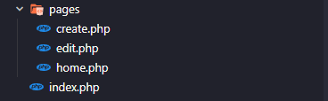](./images/edit-pages.png)

Setelah itu kita akan membuat halaman edit pada file `pages/edit.php` yang sudah kita buat tadi. Kita akan membuat halaman edit dengan menggunakan kode dibawah ini :

```html
<!-- edit form -->
<h2>Edit Student</h2>

<form action="" method="POST">
  <div class="mb-3">
    <label for="name" class="form-label">Name</label>
    <input
      type="text"
      class="form-control"
      id="name"
      name="name"
      placeholder="Enter name"
      autocomplete="off"
      required
      autofocus
      value="<?= $student['name'] ?>"
    />
  </div>
  <div class="mb-3">
    <label for="nim" class="form-label">Nim</label>
    <input
      type="number"
      class="form-control"
      id="nim"
      name="nim"
      placeholder="Enter nim"
      autocomplete="off"
      required
      value="<?= $student['nim'] ?>"
    />
  </div>
  <div class="mb-3">
    <label for="class" class="form-label">Class</label>
    <select name="class" id="class" class="form-select" required>
      <option value="" disabled selected>Select class</option>
      <option value="10">10</option>
      <option value="11">11</option>
      <option value="12">12</option>
    </select>
  </div>
  <div class="mb-3">
    <label for="major" class="form-label">Major</label>
    <select name="major" id="major" class="form-select" required>
      <option value="" disabled selected>Select major</option>
      <option value="RPL">RPL</option>
      <option value="AKL">AKL</option>
      <option value="OTKP">OTKP</option>
      <option value="BDP">BDP</option>
    </select>
  </div>
  <div class="mb-3">
    <label for="address" class="form-label">Address</label>
    <textarea
      name="address"
      id="address"
      class="form-control"
      placeholder="Enter address"
      autocomplete="off"
      required
      rows="5"
    ></textarea>
  </div>
  <!-- back button -->
  <a href="index.php" class="btn btn-secondary">Back</a>
  <button
    type="submit"
    name="submit"
    class="btn btn-primary"
    onclick="return confirm('Are you sure want to edit this data?')"
  >
    Edit
  </button>
</form>
```

Setelah itu kita akan menyimpan file `pages/edit.php` yang sudah kita buat tadi.
